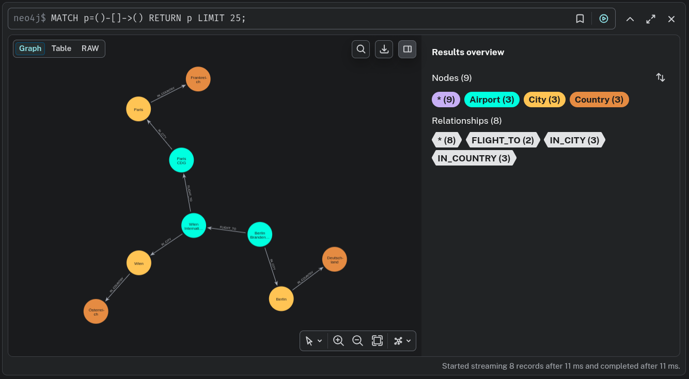

# Flights

## Nodes

### Airport

- Properties
  - code
  - name
  - maxTransferTime

### City

- Properties
  - name
  - population

### Country

- Properties
  - name
  - isSanctioned

## Edges

### FLIGHT_TO

- Properties
  - airline
  - arrTime
  - deptTime
- From Airport
- To Airport

### IN_CITY

- From Airport
- To City

### IN_COUNTRY

- From City
- To Airport

